# From Gates to Games: RISC-V CPU Co-Design & Microkernel OS

A complete, production-grade **hardware-software co-design platform** built from the register-transfer level (SystemVerilog) up to bare-metal operating system microkernels, interactive visual applications, and custom hardware accelerators.

This repository features a fully-pipelined RV32I processor, a suite of custom hardware execution subsystems (compressed instructions, L1 cache, dynamic branch prediction, hardware math, and a systolic array ML accelerator), a custom microkernel operating system, an interactive web-based simulator, and a separate bare-metal TUI Window Manager running on a QEMU-simulated RISC-V platform.

---

## 🗺️ System Co-Design Architecture

Below is the conceptual layout of the full hardware-software stack, detailing how the software applications interface with operating system layers, custom drivers, and hardware execution units.

```mermaid
graph TD
    classDef app fill:#1e293b,stroke:#3b82f6,stroke-width:2px,color:#f8fafc;
    classDef os fill:#0f766e,stroke:#14b8a6,stroke-width:2px,color:#f8fafc;
    classDef hw fill:#7c2d12,stroke:#ea580c,stroke-width:2px,color:#f8fafc;
    classDef accel fill:#581c87,stroke:#a855f7,stroke-width:2px,color:#f8fafc;

    subgraph Software Application Layer
        SnakeApp[Snake Game C App]:::app
        TUIApp[TUI Desktop Shell]:::app
    end

    subgraph Operating System & Kernel Layer
        NanoKernel[Nano-OS Kernel main.c]:::os
        Bootloader[Assembly Bootloader start.s]:::os
        QemuOS[QEMU TUI OS Kernel & GUI]:::os
    end

    subgraph Hardware Platform Core
        FetchStage[Fetch IF Stage]:::hw
        DecodeStage[Decode ID Stage]:::hw
        ExecuteStage[Execute EX Stage]:::hw
        MemoryStage[Memory MEM Stage]:::hw
        CSRUnit[Privileged CSR Unit]:::hw
        RegFile[Register File]:::hw
        UART[MMIO Virtual UART]:::hw
    end

    subgraph Custom Hardware Accelerators
        RV32C[Compressed Instruction Decoder]:::accel
        DCache[L1 Data Cache Controller + SRAM]:::accel
        BP[Dynamic Branch Predictor BHT + BTB]:::accel
        M_Ext[Booth Multiplier & Non-Restoring Divider]:::accel
        InferenceChip[Tiny Inference Chip 4x4 Systolic Array]:::accel
    end

    %% Software to OS connections
    SnakeApp -->|Syscalls: getc / putc| NanoKernel
    TUIApp -->|Window API| QemuOS

    %% OS to Hardware connections
    Bootloader -->|Spawns| NanoKernel
    NanoKernel -->|Loads/Stores| UART
    QemuOS -->|Reads/Writes| CSRUnit
    
    %% Hardware Core Stage connections
    FetchStage -->|Fetch Instr| DecodeStage
    DecodeStage -->|Decode & Control| ExecuteStage
    ExecuteStage -->|ALU Result| MemoryStage
    MemoryStage -->|Writeback Data| RegFile

    %% Hardware to Accelerator connections
    FetchStage <-->|Translate 16-bit to 32-bit| RV32C
    FetchStage <-->|Predict Next PC| BP
    ExecuteStage <-->|Accelerated Multiply / Divide| M_Ext
    ExecuteStage <-->|Custom Opcode Inference| InferenceChip
    MemoryStage <-->|L1 Cache Lookup| DCache
```



---

## ⚡ Key Hardware Subsystems

### 1. Baseline 5-Stage Pipelined Processor Core ([rtl/RV32I](rtl/RV32I))
*   **ISA Support:** Complete RV32I Base Integer Instruction Set (37 instructions), including computational, load/store, control transfer, and system operations.
*   **Pipeline Stages:**
    *   **Fetch (IF):** Implements program counter (PC) logic with stall control, exception injection, and branch/jump flushes.
    *   **Decode (ID):** Performs opcode decoding, sign/zero immediate extensions, register file reads, and generates pipeline control signals.
    *   **Execute (EX):** Contains the 32-bit ALU, PC target calculators, and forwarding multiplexers.
    *   **Memory (MEM):** Handles data memory access for word, half-word, and byte reads/writes. Integrates the CSR Unit.
    *   **Writeback (WB):** Selects register write data (ALU result, Memory loaded data, or PC+4 link values).
*   **Hazard Management:**
    *   *Forwarding Logic:* Resolves Read-After-Write (RAW) data dependencies from the MEM and WB stages back to the EX stage, maintaining execution flow without pipeline bubbles.
    *   *Load-Use Stall:* Detects load-to-use hazards, stalls Fetch and Decode, and inserts a bubble in Execute.
    *   *Control Hazard:* Instantly flushes instructions in Fetch and Decode stages on branch mispredictions or jump execution.

### 2. Privileged ISA & Control Unit ([rtl/RV32I/riscv_csr_unit.sv](rtl/RV32I/riscv_csr_unit.sv))
*   **Privilege Levels:** Supports **Machine Mode (M-mode)** for boot/kernel access, and **Supervisor Mode (S-mode)** for operating systems.
*   **Registers Implemented:**
    *   *M-Mode:* `mstatus` (privilege and interrupt status), `mtvec` (trap vector configuration), `mepc` (exception return PC), `mcause` (trap cause), and `mscratch` (context buffer).
    *   *S-Mode:* `sstatus`, `stvec`, `sepc`, and `scause`.
*   **Trap Handling:** Automated hardware exception redirection, privilege stacking, and recovery routines (`ecall`, `ebreak`, `mret`, `sret`) to enable system call invocation.

### 3. Compressed Instruction Decoder ([rtl/compressed_decoder](rtl/compressed_decoder))
*   **Concept:** Implements the **RV32C Extension** decompression.
*   **Features:** A SystemVerilog module ([riscv_core_compressed_decoder.sv](rtl/compressed_decoder/riscv_core_compressed_decoder.sv)) translates 16-bit compressed instructions into standard 32-bit RV32I instruction signals within a single cycle. It enables smaller memory footprint binaries without altering downstream pipeline stages.

### 4. L1 Data Cache (D-Cache) Subsystem ([rtl/d_cache](rtl/d_cache))
*   **Concept:** Enhances processor memory access latency.
*   **Features:** Implements a direct-mapped L1 Data Cache. Includes a D-Cache Controller ([riscv_core_dcache_controller.sv](rtl/d_cache/riscv_core_dcache_controller.sv)), cache memory SRAM ([riscv_core_dcache_memory.sv](rtl/d_cache/riscv_core_dcache_memory.sv)), and load sign-extension controllers to resolve hits/misses, fetch cache lines, and interface with main memory.

### 5. Dynamic Branch Prediction ([rtl/dynamic_branch_prediction](rtl/dynamic_branch_prediction))
*   **Concept:** Eliminates pipeline stalls due to control hazards.
*   **Features:** Integrates a **Branch History Table (BHT)** ([risc_bht.sv](rtl/dynamic_branch_prediction/risc_bht.sv)) using a 2-bit saturating counter scheme, paired with a **Branch Target Buffer (BTB)** ([risc_btb.sv](rtl/dynamic_branch_prediction/risc_btb.sv)) storing branch destination addresses. The fetch stage predicts taken/not-taken paths, and the execute stage validates predictions, performing pipeline flushes only on mispredictions.

### 6. RV32M Extension Execution Unit ([rtl/m_extension](rtl/m_extension))
*   **Concept:** High-performance hardware arithmetic operations.
*   **Features:** Connects a fully integrated **Booth's Multiplier** and a **Non-Restoring Divider** ([risc_V_non_restoring_div.sv](rtl/m_extension/design/risc_V_non_restoring_div.sv)) to the pipeline. Supports hardware multiplication (`mul`, `mulh`, `mulhsu`, `mulhu`) and division/remainder calculations (`div`, `divu`, `rem`, `remu`).

### 7. Tiny Inference Chip / Systolic Array Coprocessor ([rtl/tiny_inference_chip](rtl/tiny_inference_chip))
*   **Concept:** An on-chip neural network accelerator.
*   **Features:** Implements a **4x4 Systolic Array** ([systolic_4x4.sv](rtl/tiny_inference_chip/compute/systolic_4x4.sv)) of Processing Elements (PEs) controlled by a dedicated finite state machine (FSM). It accelerates linear classifier evaluations (dot products of weights and input features) to perform machine learning classification directly in hardware using custom instruction opcodes.

---

## 💾 Software Runtimes

### A. Bare-Metal C Nano-OS & Snake Game ([sw/src](sw/src))
*   **Bootstrap Loader (`start.s`):** Assembly entry point that sets up stacks for Machine and Supervisor modes, registers trap handling vectors, and calls the C main kernel.
*   **Nano-OS Kernel (`main.c`):** Implements character I/O, software-level trap handler dispatching, and system calls via `ecall`.
*   **Snake Game:** A lightweight C implementation of Snake running bare-metal on the Nano-OS, interacting with a virtual UART at memory address `0x00003FF0` for real-time graphics and keyboard input.

### B. Web-Based RISC-V System Emulator ([sw/snake.html](sw/snake.html))
*   **Concept:** A zero-dependency web-based instruction set simulator.
*   **Features:** Simulates the RV32I core at ~3.5 MHz directly in your web browser. Includes a visual dashboard showing real-time registers trace, memory disassembly, virtual UART console output, and interactive keyboard input mapping.

### C. QEMU OS & Window Manager GUI ([sw/src/qemu_os](sw/src/qemu_os))
*   **Concept:** A separate bare-metal operating system targeting the **QEMU RISC-V Virt Machine**.
*   **Features:**
    *   **Double-buffered Framebuffer:** A text-cell virtual framebuffer ([framebuffer.c](sw/src/qemu_os/drivers/framebuffer.c)) that diffs the current frame against the previous one, sending ANSI VT100 escape codes only for updated cells. This eliminates screen flicker and maximizes UART bandwidth.
    *   **Window Manager:** Supports overlapping windows, title bars, borders, and input focus rotation (via `TAB`). Includes standard widget drawing helpers (labels, separators, buttons, progress bars).
    *   **Desktop Shell:** Renders a three-window dashboard: *System Info* (live RISC-V CSR readings for `mcycle` and `mstatus`), *App Launcher* (keyboard navigation to launch applications), and *Activity Log* (scrolling ring buffer logging key actions).

---

## 📁 Repository Directory Structure

```text
RISCV-MicroKernel-Architecture/
├── Standard/                    # Official RISC-V Specifications & Documentation
│   ├── RISC-V ISA Manual.pdf    # Unprivileged ISA Spec
│   └── riscv-privileged.pdf     # Privileged Architecture Spec
├── rtl/                         # Hardware SystemVerilog RTL Source Files
│   ├── RV32I/                   # Base Core Pipeline, Hazards, CSR, and UART
│   │   ├── riscv_top_pipeline.sv    # Top-level datapath wrapper
│   │   ├── riscv_csr_unit.sv        # Control & Status Registers + Trap router
│   │   ├── riscv_data_mem.sv        # RAM + MMIO UART decoder
│   │   ├── riscv_hazard_unit.sv     # Forwarding and load-use stall unit
│   │   ├── riscv_fetch_stage.sv     # Stage 1: Fetch (IF)
│   │   ├── riscv_decode_stage.sv    # Stage 2: Decode (ID)
│   │   ├── riscv_execute_stage.sv   # Stage 3: Execute (EX)
│   │   ├── riscv_memory_stage.sv    # Stage 4: Memory (MEM)
│   │   └── riscv_top_tb.sv          # Main verification testbench
│   ├── compressed_decoder/      # RV32C 16-bit instruction translation module
│   ├── d_cache/                 # Direct-mapped L1 Data Cache + SRAM memory
│   ├── dynamic_branch_prediction/ # Branch Predictor (BHT + BTB + resolve logic)
│   ├── m_extension/             # Booth's Multiplier & Non-Restoring Divider
│   └── tiny_inference_chip/     # 4x4 Systolic Array machine learning accelerator
├── sim/                         # RTL verification scripts (ModelSim/QuestaSim)
├── sw/                          # Software Ecosystem (C & Assembly)
│   ├── build/                   # Compilation build artifacts (.elf, .hex, .dis)
│   ├── src/                     # Code sources
│   │   ├── main.c               # Snake Game and Nano-OS kernel
│   │   ├── start.s              # Assembly bootloader & trap handlers
│   │   ├── riscv_test.s         # Baseline instruction pipeline test
│   │   └── qemu_os/             # Complete bare-metal GUI OS for QEMU virt
│   ├── linker.ld                # Linker memory layout for custom RTL core
│   ├── play_game.py             # Python script routing keyboard input to RTL UART
│   ├── snake.html               # Web-based RV32I system emulator dashboard
│   ├── build.bat / build.ps1    # Automated compilation scripts for Windows
│   └── Makefile                 # Make compilation rules for Linux/WSL/Git Bash
├── book.md                      # Full integration verification assembly test
├── chapter_6_privileged_isa.md  # Detailed manual on CSR & trap architecture
├── os_design_slides.md          # Architectural presentation slides
├── tui_design_guide.md          # Deep dive manual on building the TUI Window Manager
└── run_xsim.bat / run_xsim_snake.bat # Vivado hardware simulation scripts
```

---

## 🚀 Running & Play Instructions

Choose one of three modes to run and explore the system:

### Method A: Web-Based RV32I Emulator (Zero Setup)
Runs the compiled firmware inside a real-time JS emulator with register tracing.

1.  **Build the firmware binary:**
    Navigate to the `sw/` folder in your terminal and compile the program:
    ```powershell
    cd sw
    ./build.ps1
    ```
2.  **Launch the emulator:**
    Open the [snake.html](sw/snake.html) page in any web browser.
3.  **Load the ROM:**
    Click the **LOAD FIRMWARE.HEX** button at the top-left, navigate to `sw/build/`, and select the **`firmware.hex`** file.
4.  **Control the Snake:**
    Click inside the terminal window to focus. Use **W / A / S / D** or Arrow keys to move the snake, and **R** to restart the game.

---

### Method B: Questa/ModelSim RTL Simulation
Simulates the physical hardware gates of the processor cycle-by-cycle.

1.  **Compile the software binary:**
    ```powershell
    cd sw
    ./build.ps1
    ```
2.  **Start the Keyboard Input Router:**
    Open a dedicated terminal and run:
    ```powershell
    python sw/play_game.py
    ```
    Keep this terminal focused during gameplay. It intercepts keyboard presses and routes them to the simulated hardware UART.
3.  **Start the Simulator:**
    Open another terminal window, navigate to `rtl/RV32I/`, and run ModelSim compilation:
    ```powershell
    vsim -c -do "vlib work; vlog *.sv; vsim riscv_top_tb; run -all"
    ```
    The simulated terminal will render the ASCII snake board directly inside the simulator's standard console. Controls: **W / A / S / D** (sent via the feeder) and **Q** to reset.

*Note: You can also use Vivado's simulator by running the `run_xsim_snake.bat` script.*

---

### Method C: Bare-Metal QEMU OS & TUI Dashboard
Runs the advanced window manager shell inside QEMU's virtual platform.

1.  **Prerequisites:**
    *   **QEMU:** Verify that `qemu-system-riscv32` is installed and on your system path.
    *   **Terminal:** Use **Windows Terminal** or **PuTTY** (standard CMD does not support 256-color ANSI VT100 control codes).
2.  **Compile the OS:**
    Navigate to the QEMU source directory and build:
    ```powershell
    cd sw/src/qemu_os
    ./build_qemu_os.ps1
    ```
3.  **Run QEMU:**
    Start the simulator to boot the OS:
    ```powershell
    qemu-system-riscv32 -machine virt -nographic -bios none -m 128M -kernel build/qemu_os.elf
    ```
4.  **Interact with the GUI:**
    *   Press **`TAB`** to switch window focus.
    *   Use **`W` / `S`** or Arrow keys to navigate menu lists in the launcher.
    *   Press **`ENTER`** to trigger buttons.
    *   Press **`Q`** to halt the OS kernel, or **`Ctrl-A` then `X`** to exit the QEMU emulator entirely.

---

## 🔍 Architectural Deep Dives

### Privilege Redirection and Trap Flow
When an exception or system call occurs (e.g., `ecall`), the hardware handles redirection:
1. The CPU stores the trapping instruction's address in `mepc` (M-mode) or `sepc` (S-mode).
2. The reason for the trap (cause encoding) is saved to `mcause` or `scause`.
3. The current privilege mode is saved to `mstatus.MPP` or `sstatus.SPP`.
4. The CPU transitions to M-mode or S-mode and jumps the program counter (PC) to the address loaded in `mtvec` or `stvec`.
5. The trap handler saves CPU registers to stack, dispatches the system call or registers error logs, and calls `mret`/`sret` to restore the previous execution state and return.

### Framebuffer Diffing Engine
To render a 256-color graphical interface over a 115200-baud UART without lagging or flickering, the QEMU OS uses two matrices:
*   `fb_cur[24][80]` (holds the target frame drawn by widgets).
*   `fb_prev[24][80]` (holds the frame currently shown on the screen).

The flush routine evaluates:
$$\forall (y, x) \in [0, 23] \times [0, 79], \quad \text{if } fb\_cur[y][x] \neq fb\_prev[y][x]$$
Only when this assertion is true does the compiler emit the VT100 move cursor code `\033[y;xH`, update the colors, write the new character, and copy the value to `fb_prev`. This slashes UART throughput requirements by up to 95%, keeping animations smooth.

### Systolic Array Matrix Multiplication
The on-chip ML accelerator operates a 4x4 array of processing elements (PEs). Each PE contains a multiply-accumulate (MAC) circuit, a weight register, and local data routing buffers.
*   **Step 1:** Weights are loaded into the PEs row-by-row via custom instructions.
*   **Step 2:** Feature vectors are streamed column-by-column into the left boundary PEs.
*   **Step 3:** Partial products flow horizontally and vertically through registers on each clock tick.
*   **Step 4:** Results are collected from the output registers and parsed by a classifier to choose the output class, avoiding software ALU computation cycles.

---

## 📚 References & Standards
*   [RISC-V Unprivileged ISA Specification](Standard/RISC-V%20ISA%20Manual.pdf)
*   [RISC-V Privileged ISA Specification](Standard/riscv-privileged.pdf)
*   [TUI Design Guide & Specifications](tui_design_guide.md)