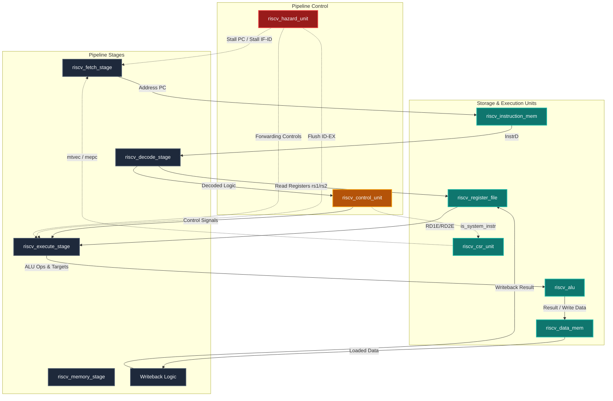

# RISC-V Microkernel and Hardware-Software System

A complete co-design hardware-software system built around an advanced bare-metal RISC-V (RV32I) 5-stage pipelined processor core. This repository features a fully integrated pipeline, a hardware Privilege and CSR unit, a custom microkernel nano-OS, a real-time Snake game, and verification tools including a visual web-based system emulator.

---

## Core Architecture and Features

### 5-Stage Pipelined Processor Core
*   **ISA Support:** Complete RV32I Base Integer Instruction Set (37 instructions), including computational, load/store, control transfer, and system operations.
*   **Pipeline Stages:**
    *   **Fetch (IF):** Program counter (PC) logic with pipeline registers, stalling, and branch/jump flushes. Instantiates `riscv_instruction_mem.sv`.
    *   **Decode (ID):** Instruction decoding, immediate extensions, register file reads, and pipeline control signals. Instantiates `riscv_register_file.sv`, `riscv_control_unit.sv`, and `riscv_extend.sv`.
    *   **Execute (EX):** Houses the ALU, PC target calculators, and input bypass multiplexers. Instantiates `riscv_alu.sv` and `riscv_pc_target.sv`.
    *   **Memory (MEM):** Handles data memory access for word, half-word, and byte read/write operations (both signed and unsigned). Instantiates `riscv_data_mem.sv`.
    *   **Writeback (WB):** Selects register write data (ALU, Memory Read, or PC + 4) via `riscv_mux_3_1.sv`.
*   **Register File:** 32 x 32-bit register array with write-on-falling-edge (negedge) to enable same-cycle bypassing. Register `x0` is hardwired to zero.

### Hazard Management Unit
*   **Data Hazard Resolution:** Forwarding logic handles RAW (Read-After-Write) dependencies from the Memory (MEM) and Writeback (WB) stages to the Execute (EX) stage, eliminating pipeline bubbles. Managed by `riscv_hazard_unit.sv`.
*   **Load-Use Stall Logic:** Detects back-to-back Load-to-Use hazards, stalling the Fetch and Decode stages and flushing the Execute stage.
*   **Control Hazard Resolution:** Flushes instruction registers in Fetch/Decode on branch mispredictions or jumps, preventing speculative execution errors.

### Privilege and CSR Architecture
*   **CSR Unit:** Supports Machine (M-mode) and Supervisor (S-mode) privilege modes. Registers include `mstatus`, `mtvec`, `mepc`, `mcause`, `stvec`, `sepc`, and `scause`. Managed in `riscv_csr_unit.sv`.
*   **Trap Handling:** Implements hardware-driven exception redirection, privilege stacking, and recovery routines (`ecall`, `ebreak`, `mret`, `sret`) to enable operating system tasks and syscall execution.

### Microkernel OS and Software Stack
*   **Bootstrap Loader:** The startup assembly bootstrap (`start.s`) configures system registers, builds stacks, sets trap vector registers, and invokes the kernel.
*   **Nano-OS Kernel:** The C kernel (`main.c`) manages input/output routing, handles syscall interrupts via `ecall` (e.g., standard print and get character operations), and controls execution.
*   **Interactive Game:** A bare-metal Snake game written in C runs directly on the OS kernel. It interfaces with a memory-mapped virtual UART at address `0x00003FF0` for real-time console rendering and keyboard input.

---

## Datapath Block Diagram



---

## Repository Directory Structure

```text
RISCV-MicroKernel-Architecture/
├── Standard/                    # Official RISC-V Specifications & Documentation
│   ├── RISC-V ISA Manual.pdf
│   └── riscv-privileged.pdf
├── rtl/
│   └── RV32I/                   # Core Hardware Logic Modules (SystemVerilog)
│       ├── riscv_pc_target.sv          # Branch & jump destination calculation
│       ├── riscv_alu.sv                # 32-bit ALU engine
│       ├── riscv_control_unit.sv       # Instruction opcode & funct decoder
│       ├── riscv_csr_unit.sv           # CSR storage & privilege control
│       ├── riscv_data_mem.sv           # Byte-addressable RAM unit with MMIO UART
│       ├── riscv_instruction_table.txt  # Instruction mapping index
│       ├── riscv_extend.sv             # Immediate generation module
│       ├── riscv_hazard_unit.sv        # Forwarding & stall controller
│       ├── riscv_instruction_mem.sv    # ROM wrapper (loads sw/build/firmware.hex)
│       ├── riscv_mux_3_1.sv            # 3-to-1 data multiplexer
│       ├── riscv_pc_src_controller.sv   # Branch validation resolver
│       ├── riscv_register_file.sv      # Dual-read single-write register array
│       ├── riscv_fetch_stage.sv        # Stage 1: Instruction Fetch (IF)
│       ├── riscv_decode_stage.sv       # Stage 2: Instruction Decode (ID)
│       ├── riscv_execute_stage.sv      # Stage 3: Instruction Execute (EX)
│       ├── riscv_memory_stage.sv       # Stage 4: Data Memory Stage (MEM)
│       ├── riscv_test.s                # Pipelined assembly verification test
│       ├── riscv_top_pipeline.sv       # Processor datapath wrapper (DUT)
│       ├── riscv_top_tb.sv             # Main simulation testbench
│       └── run.do                      # ModelSim compilation configuration
├── sim/                         # Verification scripts (ModelSim/QuestaSim)
│   ├── run.do                   # Complete pipeline test run configuration
│   ├── run_ctrl.do              # Control unit verification script
│   ├── run_hazard.do            # Hazard unit validation script
│   └── run_instr_mem.do         # Instruction memory test validation script
├── sw/                          # Software ecosystem (Bare-Metal C & Assembly)
│   ├── build/                   # Target compile artifacts (.elf, .hex, .dis)
│   ├── src/                     # Program source codes
│   │   ├── main.c               # Snake game logic & Nano-OS kernel
│   │   ├── start.s              # Assembly bootloader & trap handlers
│   │   └── riscv_test.s         # Initial instruction validation code
│   ├── Makefile                 # GCC automated Linux/Windows build flow
│   ├── build.bat                # Windows Command Prompt build execution
│   ├── build.ps1                # Windows PowerShell build utility
│   ├── elf2hex.py               # ELF binary to plain HEX formatter
│   ├── input.txt                # Keyboard input buffer file for RTL UART
│   ├── linker.ld                # Target system memory layout linker script
│   ├── play_game.py             # Keyboard capture script for RTL simulation
│   ├── snake.html               # Real-time web-based RV32I system emulator
│   └── snake.py                 # Native Python implementation of game logic
└── README.md                    # Project documentation
```

---

## Operating and Playing Instructions

You can run the Snake system in two ways: using the interactive web emulator dashboard (recommended for real-time speed) or using the RTL simulation in Questa/ModelSim.

### Method A: Web-Based RISC-V Emulator (Recommended)
This method runs your compiled RISC-V binary on a real-time instruction set emulator built directly into the codebase. It runs at ~3.5 MHz and provides register tracing.

1.  **Build the firmware:**
    Navigate to the `sw/` folder and compile the code:
    ```powershell
    cd sw
    .\build.bat
    ```
2.  **Open the emulator page:**
    Open the [snake.html](file:///C:/Users/ABDOU/Desktop/GP_folder/RISC-V/repos/RISCV-MicroKernel-Architecture/sw/snake.html) file in your web browser.
3.  **Load the compiled code:**
    Click the **LOAD FIRMWARE.HEX** button at the top-left, navigate to `sw/build/`, and select the **`firmware.hex`** file.
4.  **Play the game:**
    Click inside the terminal screen region to focus control. Use the **W / A / S / D** keys or arrow keys on your keyboard to navigate the snake. Use **R** to restart.

---

### Method B: Questa/ModelSim RTL Simulation
This method simulates the physical hardware gates of the processor cycle-by-cycle in ModelSim/Questa.

1.  **Build the firmware:**
    ```powershell
    cd sw
    .\build.bat
    ```
2.  **Start the keyboard feeder:**
    Open a dedicated terminal window and run:
    ```powershell
    python play_game.py
    ```
    Keep this window active/focused when pressing keys. It catches inputs and routes them to the simulation.
3.  **Start the simulation:**
    Open another terminal window, navigate to `rtl/RV32I`, and run:
    ```powershell
    vsim -c -do "vlib work; vlog *.sv; vsim riscv_top_tb; run -all"
    ```
    The simulated terminal screen will render the board inside the console output. Controls are **W / A / S / D** (sent from the `play_game.py` window) and **Q** to reset.

---

## File Reference Index

### Core Hardware Modules
*   [riscv_top_pipeline.sv](file:///C:/Users/ABDOU/Desktop/GP_folder/RISC-V/repos/RISCV-MicroKernel-Architecture/rtl/RV32I/riscv_top_pipeline.sv): Main wrapper connecting pipeline stages and units.
*   [riscv_csr_unit.sv](file:///C:/Users/ABDOU/Desktop/GP_folder/RISC-V/repos/RISCV-MicroKernel-Architecture/rtl/RV32I/riscv_csr_unit.sv): CSR register bank and trap redirection.
*   [riscv_data_mem.sv](file:///C:/Users/ABDOU/Desktop/GP_folder/RISC-V/repos/RISCV-MicroKernel-Architecture/rtl/RV32I/riscv_data_mem.sv): Data memory RAM and memory-mapped console.
*   [riscv_hazard_unit.sv](file:///C:/Users/ABDOU/Desktop/GP_folder/RISC-V/repos/RISCV-MicroKernel-Architecture/rtl/RV32I/riscv_hazard_unit.sv): Pipeline hazard processor controller.
*   [riscv_top_tb.sv](file:///C:/Users/ABDOU/Desktop/GP_folder/RISC-V/repos/RISCV-MicroKernel-Architecture/rtl/RV32I/riscv_top_tb.sv): Testbench harness.

### Software Stack
*   [main.c](file:///C:/Users/ABDOU/Desktop/GP_folder/RISC-V/repos/RISCV-MicroKernel-Architecture/sw/src/main.c): Kernel execution path and Snake game code.
*   [start.s](file:///C:/Users/ABDOU/Desktop/GP_folder/RISC-V/repos/RISCV-MicroKernel-Architecture/sw/src/start.s): Assembly startup bootstrap and exception handler routines.
*   [linker.ld](file:///C:/Users/ABDOU/Desktop/GP_folder/RISC-V/repos/RISCV-MicroKernel-Architecture/sw/linker.ld): System memory linker mapping layout.
*   [build.bat](file:///C:/Users/ABDOU/Desktop/GP_folder/RISC-V/repos/RISCV-MicroKernel-Architecture/sw/build.bat): Windows compilation batch utility.
