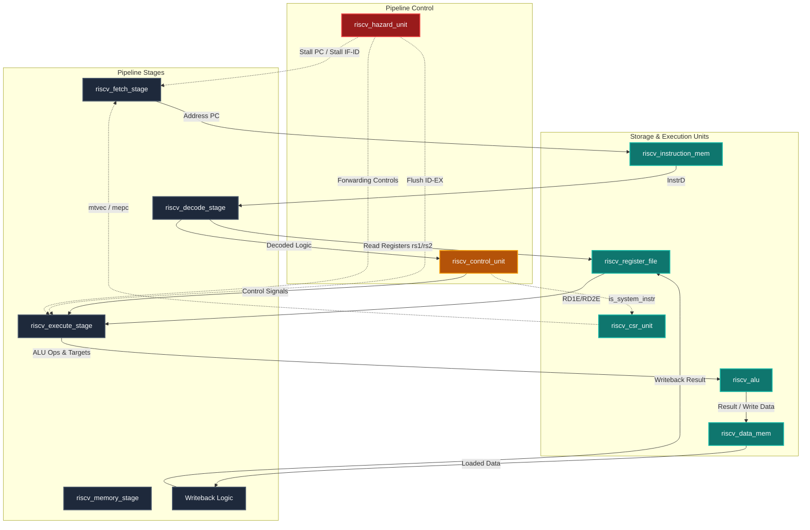

# 🚀 RISC-V 5-Stage Pipelined Processor Core (RV32I)

An advanced, bare-metal **RISC-V (RV32I)** 5-stage pipelined processor core written in SystemVerilog. The architecture is designed to support microkernel operating system features, containing dynamic hazard resolution, full instruction/data memory interfaces, and control status registers (CSR) tailored for trap/exception handling.

---

## 📌 Features

### 💻 Core Architecture
*   **ISA Support:** Complete RV32I Base Integer Instruction Set (37 instructions), including computational, load/store, control transfer, and system operations.
*   **5-Stage Classic Pipeline:**
    *   **Fetch (IF):** Implements program counter (PC) logic with pipeline registers, stalling, and branch/jump flushes. Instantiates `riscv_instruction_mem.sv`.
    *   **Decode (ID):** Houses instruction decoding, immediate extensions, register file reads, and pipeline control signals. Instantiates `riscv_register_file.sv`, `riscv_control_unit.sv`, and `riscv_extend.sv`.
    *   **Execute (EX):** Contains the ALU, PC target calculators, and input bypass muxes. Instantiates `riscv_alu.sv` and `riscv_pc_target.sv`.
    *   **Memory (MEM):** Interchanges data with the RAM unit. Supports half-word, byte, and word operations (signed & unsigned). Instantiates `riscv_data_mem.sv`.
    *   **Writeback (WB):** Selects final destination register data (ALU, Memory Read, or PC + 4) via `riscv_mux_3_1.sv`.
*   **Register File:** $32 \times 32$-bit register array. Write-on-falling-edge (negedge) enables same-cycle bypassing, and `x0` is hardwired to zero.

### ⚡ Hazard Management
*   **Data Hazard Resolution:** Implements forwarding from the Memory (MEM) and Writeback (WB) stages to the Execution (EX) stage, eliminating stalls for RAW hazards. Controlled by `riscv_hazard_unit.sv`.
*   **Load-Use Stall Logic:** Detects back-to-back Load-to-Use hazards, automatically stalling the Fetch and Decode stages while flushing the Execute stage.
*   **Control Hazard Resolution:** Automatically flushes instruction registers in Fetch/Decode on branch mispredictions or jumps, preventing speculative execution errors.

### 🛡️ OS & Microkernel Foundations
*   **CSR Unit:** Houses foundational control and status registers (`mstatus`, `mtvec`, `mepc`, `mcause`). Defined in `riscv_csr_unit.sv`.
*   **Trap Handling:** Implements hardware-driven exception redirection and recovery (`ecall`, `mret` routines) supporting future microkernel scheduling and context switching.

---

## 🗺️ Datapath Block Diagram



---

## 📁 Repository Directory Structure

The workspace is organized into modular directories separation for hardware descriptions, software compiling utility, design testing, and standards documentation:

```text
RISCV-MicroKernel-Architecture/
├── Standard/                   # Official RISC-V Specifications & Documentation
│   ├── RISC-V ISA Manual.pdf
│   └── riscv-privileged.pdf
├── rtl/
│   └── RV32I/                  # Core Hardware Logic Modules (SystemVerilog)
│       ├── riscv_pc_target.sv         # Branch & jump destination calculation
│       ├── riscv_alu.sv               # 32-bit ALU engine
│       ├── riscv_control_unit.sv      # Instruction opcode & funct decoder
│       ├── riscv_csr_unit.sv          # CSR storage & privilege control
│       ├── riscv_data_mem.sv          # Byte-addressable RAM unit
│       ├── riscv_instruction_table.txt # RV32I instruction mapping index (renamed from eddd.txt)
│       ├── riscv_extend.sv            # Immediate generation module
│       ├── riscv_hazard_unit.sv       # Forwarding & stall controller
│       ├── riscv_instruction_mem.sv   # Bootable ROM wrapper (uses $readmemh)
│       ├── riscv_mux_3_1.sv           # 3-to-1 data multiplexer
│       ├── riscv_pc_src_controller.sv  # Branch validation resolver
│       ├── riscv_register_file.sv     # Dual-read single-write register array
│       ├── riscv_fetch_stage.sv       # Stage 1: Instruction Fetch (IF)
│       ├── riscv_decode_stage.sv      # Stage 2: Instruction Decode (ID)
│       ├── riscv_execute_stage.sv     # Stage 3: Instruction Execute (EX)
│       ├── riscv_memory_stage.sv      # Stage 4: Data Memory Stage (MEM)
│       ├── riscv_test.s               # Pipelined processor assembly workload
│       ├── riscv_top_pipeline.sv      # Processor datapath wrapper (DUT)
│       ├── riscv_top_tb.sv            # Cycle-by-cycle debugger testbench
│       └── run.do                     # ModelSim compilation and tb script
├── sim/                        # Verification scripts (ModelSim/QuestaSim)
│   ├── run.do                  # Complete pipeline test run configuration
│   ├── run_ctrl.do             # Control unit verification script
│   ├── run_hazard.do           # Hazard unit validation script
│   └── run_instr_mem.do        # Instruction memory test validation script
├── sw/                         # Software ecosystem (Bare-Metal C & Assembly)
│   ├── build/                  # Target compile artifacts (.elf, .hex, .dis)
│   ├── src/                    # Program source codes
│   │   ├── main.c              # C workload logic
│   │   └── start.s             # Assembly bootloader bootstrap
│   ├── Makefile                # GCC automated Linux/Windows build flow
│   ├── build.bat               # Windows Command Prompt build execution
│   ├── build.ps1               # Windows PowerShell build utility
│   ├── elf2hex.py              # ELF program executable binary to HEX formatter
│   └── linker.ld               # Memory layout configuration file
├── README.md                   # Project documentation
└── vide.toml                   # Project indexing settings
```

---

## 🛠️ Software Compilation Flow

The software directory contains a bare-metal program (`main.c`) bootstrapped by an assembly startup routine (`start.s`). The program initializes the processor's environment and performs integer calculations, which terminate in an infinite loop.

### 📋 Prerequisites
Ensure you have the RISC-V toolchain installed. The scripts are pre-configured to use the `xpack-riscv-none-elf-gcc` compiler. 

### 🔧 Build Commands
Navigate to the `sw/` directory:
```bash
cd sw
```

Choose one of the following methods to build the software:

*   **GNU Make:**
    ```bash
    make all
    ```
*   **Windows Batch Script:**
    ```cmd
    build.bat
    ```
*   **PowerShell Script:**
    ```powershell
    ./build.ps1
    ```

### ⚙️ Compilation Actions
1.  **Assembly Bootstrap Compilation:** Compiles [start.s](file:///C:/Users/ABDOU/Desktop/GP_folder/RISC-V/repos/RISCV-MicroKernel-Architecture/sw/src/start.s) with `-march=rv32i -mabi=ilp32` flags.
2.  **C Program Compilation:** Compiles [main.c](file:///C:/Users/ABDOU/Desktop/GP_folder/RISC-V/repos/RISCV-MicroKernel-Architecture/sw/src/main.c) using Optimization level 1 (`-O1`) to limit stack usage.
3.  **Linker Layout Alignment:** Combines object files using [linker.ld](file:///C:/Users/ABDOU/Desktop/GP_folder/RISC-V/repos/RISCV-MicroKernel-Architecture/sw/linker.ld) to load instruction memory at `0x00000000`.
4.  **Binary to Hex Translation:** Converts the compiled ELF firmware output to a plain hexadecimal representation using [elf2hex.py](file:///C:/Users/ABDOU/Desktop/GP_folder/RISC-V/repos/RISCV-MicroKernel-Architecture/sw/elf2hex.py). This hex file is directly read by SystemVerilog's `$readmemh` simulation command.
5.  **Assembly Disassembly:** Generates a `firmware.dis` file inside `build/` to enable debugging alongside simulation trace dumps.

---

## 🧪 Simulation & Verification

The core can be simulated using ModelSim or QuestaSim. The testbench compiles the design, launches the simulation, and displays a live tracing table of the CPU's pipeline.

### 💻 Running Simulations
To simulate the core with the compiled program, open your ModelSim/QuestaSim terminal and execute:
```tcl
do sim/run.do
```

Alternatively, to test individual modules, use:
*   **Control Unit:** `do sim/run_ctrl.do`
*   **Hazard Unit:** `do sim/run_hazard.do`
*   **Instruction Memory:** `do sim/run_instr_mem.do`

### 📝 Debug Output Example
When running the simulation, a detailed cycle-by-cycle pipeline trace is dumped to the simulator stdout:

```text
================ PIPELINE DEBUG =================
Cycle |      FETCH (PCF / InstrF)      |    DECODE (InstrD)   |                  EXECUTE (RD1/RD2/ALU/CTRL)                  |   MEMORY        |   WRITEBACK
------------------------------------------------------------------------------------------------------------------------------------------------------------------------------------
 (PCSrcE=0, target_taken=0, Branch=0)  ====    1   |       00000000 / 00000f13        |     00000000    |         RD1=00000000 RD2=00000000 ALU=00000000 S=0 B=0 J=0      | 00000000 W=0 | Rd=0 W=0 Res=00000000
 (PCSrcE=0, target_taken=0, Branch=0)  ====    2   |       00000004 / 00000097        |     00000f13    |         RD1=00000000 RD2=00000000 ALU=00000000 S=0 B=0 J=0      | 00000000 W=0 | Rd=0 W=0 Res=00000000
 (PCSrcE=0, target_taken=0, Branch=0)  ====    3   |       00000008 / 00000513        |     00000097    |         RD1=00000000 RD2=00000000 ALU=00000f00 S=1 B=0 J=0      | 00000000 W=0 | Rd=2 W=1 Res=00000f00
...
```

---

## 🔗 File Reference Index

Below are direct references to key modules in the codebase for ease of access:

### ⚡ RTL Hardware Files
*   [riscv_top_pipeline.sv](file:///C:/Users/ABDOU/Desktop/GP_folder/RISC-V/repos/RISCV-MicroKernel-Architecture/rtl/RV32I/riscv_top_pipeline.sv): Pipelined processor datapath wrapper.
*   [riscv_fetch_stage.sv](file:///C:/Users/ABDOU/Desktop/GP_folder/RISC-V/repos/RISCV-MicroKernel-Architecture/rtl/RV32I/riscv_fetch_stage.sv): Stage 1 Instruction Fetch module.
*   [riscv_decode_stage.sv](file:///C:/Users/ABDOU/Desktop/GP_folder/RISC-V/repos/RISCV-MicroKernel-Architecture/rtl/RV32I/riscv_decode_stage.sv): Stage 2 Instruction Decode module.
*   [riscv_execute_stage.sv](file:///C:/Users/ABDOU/Desktop/GP_folder/RISC-V/repos/RISCV-MicroKernel-Architecture/rtl/RV32I/riscv_execute_stage.sv): Stage 3 Execution module.
*   [riscv_memory_stage.sv](file:///C:/Users/ABDOU/Desktop/GP_folder/RISC-V/repos/RISCV-MicroKernel-Architecture/rtl/RV32I/riscv_memory_stage.sv): Stage 4 Memory control module.
*   [riscv_control_unit.sv](file:///C:/Users/ABDOU/Desktop/GP_folder/RISC-V/repos/RISCV-MicroKernel-Architecture/rtl/RV32I/riscv_control_unit.sv): Core instruction control decoder.
*   [riscv_alu.sv](file:///C:/Users/ABDOU/Desktop/GP_folder/RISC-V/repos/RISCV-MicroKernel-Architecture/rtl/RV32I/riscv_alu.sv): Core arithmetic logic unit.
*   [riscv_hazard_unit.sv](file:///C:/Users/ABDOU/Desktop/GP_folder/RISC-V/repos/RISCV-MicroKernel-Architecture/rtl/RV32I/riscv_hazard_unit.sv): Pipeline hazard processor controller.
*   [riscv_csr_unit.sv](file:///C:/Users/ABDOU/Desktop/GP_folder/RISC-V/repos/RISCV-MicroKernel-Architecture/rtl/RV32I/riscv_csr_unit.sv): CSR register array and trap routing logic.
*   [riscv_data_mem.sv](file:///C:/Users/ABDOU/Desktop/GP_folder/RISC-V/repos/RISCV-MicroKernel-Architecture/rtl/RV32I/riscv_data_mem.sv): Byte-addressable RAM representation.
*   [riscv_instruction_mem.sv](file:///C:/Users/ABDOU/Desktop/GP_folder/RISC-V/repos/RISCV-MicroKernel-Architecture/rtl/RV32I/riscv_instruction_mem.sv): Instruction ROM wrapper.
*   [riscv_register_file.sv](file:///C:/Users/ABDOU/Desktop/GP_folder/RISC-V/repos/RISCV-MicroKernel-Architecture/rtl/RV32I/riscv_register_file.sv): Main register file.
*   [riscv_top_tb.sv](file:///C:/Users/ABDOU/Desktop/GP_folder/RISC-V/repos/RISCV-MicroKernel-Architecture/rtl/RV32I/riscv_top_tb.sv): Main debugging testbench wrapper.

### 💿 Software Files
*   [Makefile](file:///C:/Users/ABDOU/Desktop/GP_folder/RISC-V/repos/RISCV-MicroKernel-Architecture/sw/Makefile): GNU Makefile for code builds.
*   [build.bat](file:///C:/Users/ABDOU/Desktop/GP_folder/RISC-V/repos/RISCV-MicroKernel-Architecture/sw/build.bat): Windows batch script compiler.
*   [build.ps1](file:///C:/Users/ABDOU/Desktop/GP_folder/RISC-V/repos/RISCV-MicroKernel-Architecture/sw/build.ps1): PowerShell script compilation wrapper.
*   [linker.ld](file:///C:/Users/ABDOU/Desktop/GP_folder/RISC-V/repos/RISCV-MicroKernel-Architecture/sw/linker.ld): Target system memory linker script layout.
*   [elf2hex.py](file:///C:/Users/ABDOU/Desktop/GP_folder/RISC-V/repos/RISCV-MicroKernel-Architecture/sw/elf2hex.py): Conversion tool from program ELF to simulation HEX format.

---

> [!NOTE]  
> If you change your software program in [main.c](file:///C:/Users/ABDOU/Desktop/GP_folder/RISC-V/repos/RISCV-MicroKernel-Architecture/sw/src/main.c), remember to re-run the build script to regenerate the firmware binary memory hex mapping file before firing up the simulation in ModelSim/QuestaSim!