# Operating System Design
### From Bare Metal to a Real Terminal UI
#### RISC-V MicroKernel Architecture — Design Walkthrough

> **Project:** RISC-V MicroKernel Architecture  
> **Platform:** Custom RV32I RTL Processor → QEMU `virt` Machine  
> **Stack:** SystemVerilog Hardware · Assembly Bootloader · C Kernel · TUI GUI

---

---

## Slide 1 — What Is an Operating System?

An **Operating System** is software that sits between hardware and user applications.
It answers three fundamental questions:

| Question | OS Answer |
|---|---|
| Who manages the CPU? | The **scheduler** (or main loop in our nano-OS) |
| Who owns the hardware? | The **kernel** — all hardware access goes through it |
| How do apps talk to hardware? | Through **system calls** (ecall in RISC-V) |

In our project we built this from **absolute zero** — no Linux, no RTOS, no libc.

```
  ┌────────────────────────────────────────────┐
  │              User Application              │  ← Snake Game, Desktop GUI
  ├────────────────────────────────────────────┤
  │                  Kernel                    │  ← main.c / kernel.c
  ├────────────────────────────────────────────┤
  │          Hardware Abstraction Layer        │  ← UART driver, framebuffer
  ├────────────────────────────────────────────┤
  │              Physical Hardware             │  ← RISC-V CPU, UART, RAM
  └────────────────────────────────────────────┘
```

> **Key insight:** Every layer only talks to the layer directly below it.  
> This discipline is what makes an OS reliable.

---

---

## Slide 2 — The Big Picture: Two Generations of OS

We designed **two distinct operating systems**, each targeting a different platform.

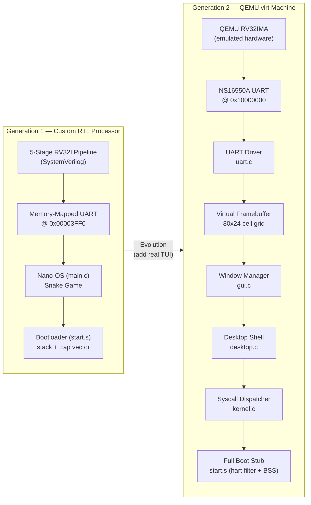

> **Why two generations?**  
> Gen 1 proved the concept — bare metal C on custom silicon.  
> Gen 2 added a real industry-grade software stack running on QEMU,  
> using the exact same techniques as production embedded Linux systems.

---

---

## Slide 3 — The Hardware Foundation: Custom 5-Stage Pipeline

Before writing a single line of OS code, we needed a processor.

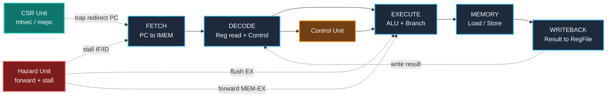

### Pipeline Stages Explained

| Stage | Key Module | What Happens |
|---|---|---|
| **IF** | `riscv_fetch_stage.sv` | PC advances; 32-bit instruction fetched from ROM |
| **ID** | `riscv_decode_stage.sv` | Opcode decoded; rs1/rs2 read from register file |
| **EX** | `riscv_execute_stage.sv` | ALU computes; branch targets calculated |
| **MEM** | `riscv_memory_stage.sv` | Data RAM read/write; MMIO UART at `0x3FF0` |
| **WB** | Writeback mux | Result written back to register file |

### Hazard Management — Why It Matters for an OS

Without hazard handling, the OS trap handler assembly would silently produce **wrong results**.

```
  Instruction 1:  lw  a0, 0(t0)     <- loads from UART (memory read)
  Instruction 2:  beq a0, zero, ... <- uses a0 one cycle later  <- HAZARD!

  Solution:  Load-Use Stall -- IF and ID are frozen for 1 cycle.
             The HazardUnit detects this automatically.
```

---

---

## Slide 4 — Privilege Architecture: The OS Security Ring

RISC-V defines privilege modes — the hardware enforces OS isolation.

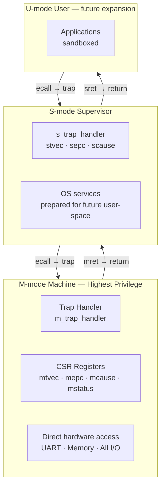

### Key CSRs We Use

| CSR | Purpose |
|---|---|
| `mtvec` | Points to `m_trap_handler` — the OS entry point |
| `mepc` | Saved PC of the instruction that triggered the trap |
| `mcause` | Why did the trap happen? (ecall = 11, others = exceptions) |
| `mstatus` | Global interrupt enable / privilege stack |
| `mhartid` | Which hardware thread (hart) are we on? |

> **Design rule:** Whenever user code needs hardware, it calls `ecall`.  
> The CPU automatically switches to M-mode and jumps to `mtvec`.  
> The OS handles it, then `mret` returns to exactly where we left off.

---

---

## Slide 5 — Generation 1: The Nano-OS Design

### Memory Map (Custom RTL Processor)

```
  Address Space (32-bit)
  ┌─────────────────┬─────────────────────────────────────────┐
  │  0x00000000     │  .text  — Code (ROM / IMEM)             │
  │  ...            │  Assembly bootloader + C kernel         │
  ├─────────────────┼─────────────────────────────────────────┤
  │  0x00002000     │  .data  — Initialised global variables  │
  │  0x00002xxx     │  .bss   — Zero-initialised globals      │
  │                 │  (snake state, trap flags)              │
  ├─────────────────┼─────────────────────────────────────────┤
  │  0x00003FF0     │  MMIO UART — 1 byte read/write          │
  │                 │  (memory-mapped console I/O)            │
  ├─────────────────┼─────────────────────────────────────────┤
  │  0x00003FFC     │  PLATFORM_ID — read to detect emulator  │
  │                 │  0x454D554C = "EMUL" (web emulator)     │
  └─────────────────┴─────────────────────────────────────────┘
```

### Boot Sequence

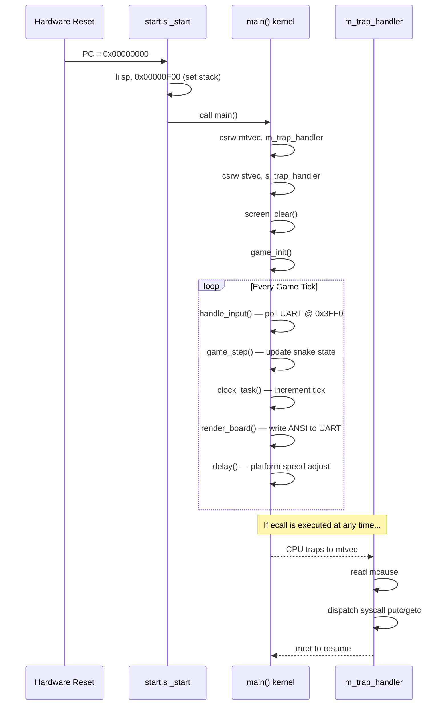

---

---

## Slide 6 — Generation 1: Key Design Decisions

### Decision 1 — Direct MMIO vs. ecall for I/O

We used **direct MMIO** for the final game, bypassing the trap mechanism:

```c
// Direct MMIO — zero overhead
#define UART_ADDR ((volatile unsigned char *)0x00003FF0)

static void sys_putc(unsigned char ch) {
    *UART_ADDR = ch;   // single SW instruction -> hits MEM stage -> UART
}
```

**Why?** Each `ecall` takes ~6 extra cycles (trap + CSR save + mret).  
The Snake game sends hundreds of characters per frame — direct MMIO keeps it fast.

### Decision 2 — Platform Detection at Runtime

```c
#define PLATFORM_ADDR ((volatile unsigned int *)0x00003FFC)

static void delay(void) {
    unsigned int limit = 0u;  // Zero delay for RTL sim (full speed)

    if (*PLATFORM_ADDR == 0x454D554C) {  // Read magic word: "EMUL"
        limit = 200000u;  // Slow down for high-speed web emulator
    }
    for (i = 0; i < limit; i++) asm volatile ("nop");
}
```

The **same binary** runs on two platforms (RTL sim + web emulator)  
by probing a magic address. This is exactly how real firmware detects hardware variants.

### Decision 3 — Trap Handler with MEPC Advancement

A critical OS detail: after handling a trap, we must **skip the `ecall` instruction**:

```asm
# m_syscall_handler
m_sys_done:
    csrr a0, mepc       # load PC of ecall instruction
    addi a0, a0, 4      # advance past 32-bit ecall
    csrw mepc, a0       # write back
    mret                # return to PC+4 (instruction after ecall)
```

> Without this, the CPU would loop forever re-executing the `ecall`.

---

---

## Slide 7 — Generation 1: The Rendering Pipeline

How does a bare-metal C program draw a "screen" with no GPU?

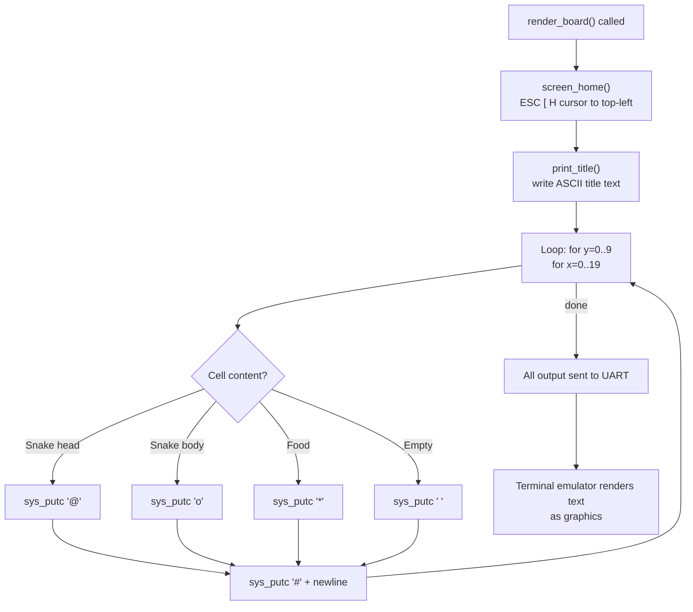

### ANSI Escape Codes — the 'GPU' of Text Terminals

```
ESC [ 2 J      -->  Clear entire screen
ESC [ H        -->  Move cursor to row 1, col 1 (home)
ESC [ 5 ; 10 H -->  Move cursor to row 5, col 10
```

These are the exact same codes that `vim`, `htop`, and `ncurses` use.  
Our bare-metal C code writes them byte-by-byte through a single MMIO address.

---

---

## Slide 8 — Generation 2: Why QEMU?

Moving from a custom RTL simulator to **QEMU** unlocks real-world capabilities:

| Feature | Custom RTL | QEMU virt |
|---|---|---|
| Clock speed | Limited by sim speed | Millions of instructions/sec |
| UART | Simple 1-byte MMIO | Full NS16550A (FIFOs, baud rate) |
| Memory | ~4 KiB addressable | 128 MiB DRAM |
| Multi-hart | Single hart | Multi-hart (we filter to hart 0) |
| Standards | Custom design | Industry-standard memory map |
| Debugging | Waveform viewer | GDB, QEMU monitor |

### QEMU `virt` Machine Memory Map

```
  ┌─────────────────┬────────────────────────────────────────────┐
  │  0x00001000     │  ROM  (QEMU reset vector — small stub)     │
  │  0x02000000     │  CLINT  (timer + software interrupts)      │
  │  0x0C000000     │  PLIC   (platform interrupt controller)    │
  │  0x10000000     │  UART0  — NS16550A  (our console)          │
  │  0x80000000     │  DRAM start — our kernel loads here        │
  │  0x87FFFFFF     │  DRAM end   (128 MiB)                      │
  └─────────────────┴────────────────────────────────────────────┘
```

> **Critical:** The linker script places `_start` at `0x80000000`.  
> QEMU's ELF loader reads the entry point and sets the initial PC to match.

---

---

## Slide 9 — Generation 2: The Full Boot Sequence

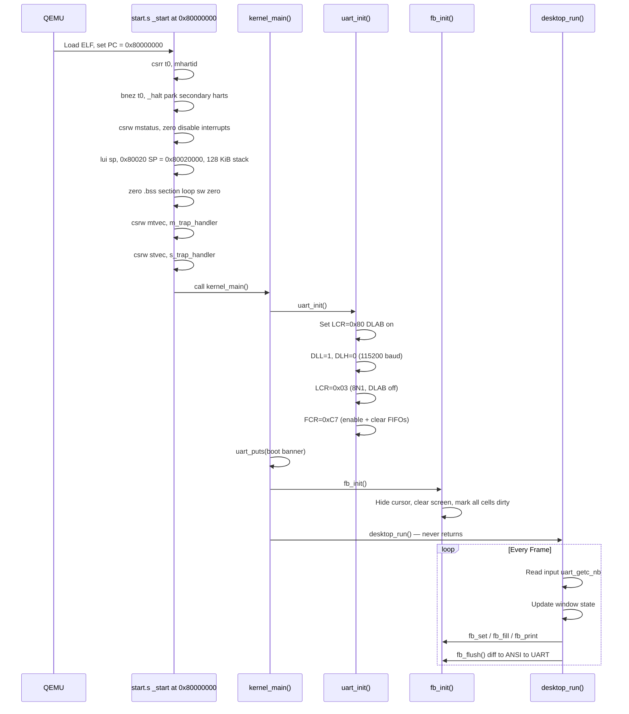

---

---

## Slide 10 — The NS16550A UART Driver

The UART (Universal Asynchronous Receiver-Transmitter) is the only I/O bridge  
between our kernel and the outside world.

### Register Map (base address `0x10000000`)

```
  Offset | DLAB=0                    | DLAB=1
  -------+---------------------------+---------------------------
    0    | THR (write) / RBR (read)  | DLL — baud divisor low
    1    | IER — Interrupt Enable    | DLH — baud divisor high
    2    | FCR (write) / IIR (read)  |
    3    | LCR — Line Control        | (set DLAB bit here)
    4    | MCR — Modem Control       |
    5    | LSR — Line Status         | <- we poll this one
```

### Initialization Sequence

```c
void uart_init(void) {
    REG(IER) = 0x00;    // 1. Disable all interrupts (polling mode)

    REG(LCR) = 0x80;    // 2. Enable DLAB to access baud divisor
    REG(DLL) = 0x01;    //    Divisor = 1 -> 115200 baud
    REG(DLH) = 0x00;    //    (clock = 1.8432 MHz / (16 x 115200) = 1)

    REG(LCR) = 0x03;    // 3. 8 data bits, No parity, 1 stop (8N1), DLAB=0

    REG(FCR) = 0xC7;    // 4. Enable FIFOs, clear TX+RX, trigger at 8 bytes

    REG(MCR) = 0x0B;    // 5. Assert RTS + DTR
}
```

### TX / RX Polling

```c
// Transmit: spin on LSR bit 5 (TX holding register empty)
void uart_putc(char c) {
    while (!(REG(LSR) & 0x20));   // wait until THR is empty
    REG(THR) = (uint8_t)c;        // write character
}

// Non-blocking receive: check LSR bit 0 (data available)
int uart_getc_nb(void) {
    if (REG(LSR) & 0x01)          // data ready?
        return (int)(uint8_t)REG(RBR);
    return -1;                    // no data
}
```

---

---

## Slide 11 — The Virtual Framebuffer System

Instead of a pixel GPU, we use a **character-cell grid** in RAM.

### Architecture

```
  RAM Layout (at kernel .bss section)
  +----------------------------------------------------------+
  |  Cell fb_cur [24][80]   -- Current frame (what to show)  |
  |  Cell fb_prev[24][80]   -- Previous frame (for diffing)  |
  +----------------------------------------------------------+

  Each Cell = 4 bytes:
  +--------+----------+----------+----------+
  |  char  | uint8_t  | uint8_t  | uint8_t  |
  |   ch   |    fg    |    bg    |   attr   |
  |  ' '   |  15(WHT) |  23(TEL) |  NORMAL  |
  +--------+----------+----------+----------+
```

### The Diff Renderer — the Key Optimization

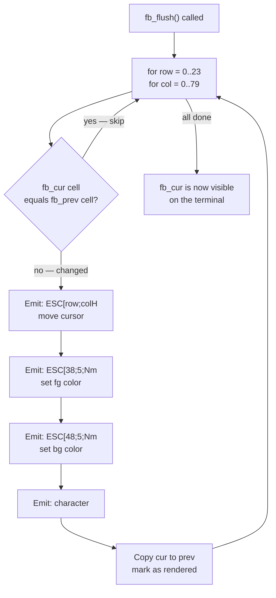

**Result:** Only changed cells are transmitted.  
At 115200 baud, every unnecessary byte saved = faster rendering.

### 256-Color Palette in Practice

```
  ESC [ 38;5;214 m    ->  Set foreground to ORANGE  (index 214)
  ESC [ 48;5;23  m    ->  Set background to DARK TEAL (index 23)
  ESC [ 1 m           ->  Bold on
  ESC [ 0 m           ->  Reset all attributes
```

This is the exact technique used by **ncurses**, **vim**, **htop**, and every real TUI application.

---

---

## Slide 12 — The Window Manager Design

### Window Descriptor

```c
typedef struct {
    int   x, y;          // Top-left corner (cell coordinates)
    int   w, h;          // Width, height in cells
    const char *title;   // Title bar text
    uint8_t flags;       // GUI_FLAG_BORDER | GUI_FLAG_TITLEBAR

    // Callbacks — the heart of the event-driven design
    void (*on_draw) (struct Window *win);
    void (*on_input)(struct Window *win, int key);

    void *user_data;     // App-private state pointer
    bool  focused;       // Is this the active window?
} Window;
```

### Two-Pass Render Algorithm

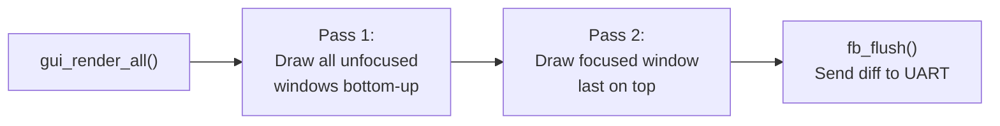

> **Why two passes?**  
> Windows overlap. Drawing the focused window last ensures its border  
> is never hidden under another window — exactly like a real window manager.

### Widget System

```
  Widget Helpers (window-relative coordinates):

  gui_label     (win, rx, ry, text, fg)        -> static text
  gui_kv_row    (win, rx, ry, key, val, ...)   -> "key:  value" pair
  gui_button    (win, rx, ry, label, active)   -> clickable button
  gui_progress  (win, rx, ry, w, pct, ...)     -> [########..] bar
  gui_separator (win, rx, ry, w)               -> dashes divider
```

---

---

## Slide 13 — The Syscall Interface (ecall Mechanism)

System calls are the **contract** between application code and the kernel.

### RISC-V Calling Convention for Syscalls

```
  Registers used:
    a7  <- syscall number   (1=putc, 2=getc, 3=yield, 4=exit)
    a0  <- first argument   (character for putc, etc.)
    a1  <- second argument
    a2  <- third argument

  After ecall:
    a0  <- return value from the kernel
```

### Flow Diagram

```mermaid
sequenceDiagram
    participant APP as Application Code
    participant CPU as RISC-V CPU
    participant TH  as m_trap_handler start.s
    participant KN  as syscall_dispatch() kernel.c

    APP ->> CPU  : li a7, 1  SYS_PUTC
    APP ->> CPU  : li a0, 'H'
    APP ->> CPU  : ecall

    CPU ->> TH   : trap! mcause=11, PC saved in mepc

    TH  ->> TH   : addi sp, sp, -40  save 10 registers
    TH  ->> TH   : csrr a0, mcause
    TH  ->> KN   : call syscall_dispatch(num=1, a0='H', ...)

    KN  ->> KN   : case 1: poll LSR bit 5
    KN  ->> KN   : write 'H' to UART THR
    KN  -->> TH  : return 0

    TH  ->> TH   : csrr t0, mepc; addi t0,t0,4; csrw mepc,t0
    TH  ->> TH   : lw ra,0(sp)... restore registers
    TH  ->> TH   : addi sp, sp, 40
    TH  ->> CPU  : mret

    CPU -->> APP : resume at PC = mepc ecall+4
```

### Syscall Table

| Number | Name | Description |
|---|---|---|
| `1` | `SYS_PUTC` | Write byte in `a0` to UART THR |
| `2` | `SYS_GETC` | Blocking read from UART RBR, return in `a0` |
| `3` | `SYS_YIELD` | Cooperative yield (no-op in current kernel) |
| `4` | `SYS_EXIT` | Park hart with `wfi` forever |

---

---

## Slide 14 — BSS Zeroing: Why It Matters

A critical boot step that is easy to forget — and catastrophic when missed.

### The Problem

```c
// Global variables in C
volatile int m_trap_occurred;   // Should start at 0
static unsigned char snake_len; // Should start at 0
Cell fb_cur[24][80];            // Should start as spaces
```

In ROM-based systems, `.bss` (uninitialized data) is **not stored in the binary**.  
At reset, RAM contains **random garbage**.

### The Solution — Hardware-Software Contract

```asm
# start.s — BSS zeroing loop
    la      t0, _bss_start    # pointer to first BSS byte
    la      t1, _bss_end      # pointer past last BSS byte
    beq     t0, t1, _bss_done # empty BSS? skip
_bss_loop:
    sw      zero, 0(t0)       # write 0 to this word
    addi    t0, t0, 4         # advance 4 bytes
    blt     t0, t1, _bss_loop # loop until done
_bss_done:
```

### Linker Script Declares the Symbols

```ld
/* linker_qemu.ld */
.bss : {
    _bss_start = .;   /* <- start.s reads this address */
    *(.bss*)
    *(.sbss*)
    *(COMMON)
    _bss_end = .;     /* <- start.s reads this address */
} > DRAM
```

> The linker creates `_bss_start` and `_bss_end` as symbols.  
> The assembler reads them as addresses to define the loop bounds.  
> This is a **hardware-software interface at the address level**.

---

---

## Slide 15 — The Linker Script: OS Memory Architecture

The linker script is the **floor plan of the OS**. It decides where everything lives.

### Generation 1 — Custom RTL Processor

```ld
/* linker.ld */
. = 0x00000000;   /* code starts at address 0 (IMEM starts here) */
.text : { *(.text) }

. = 0x00002000;   /* data starts 8 KB in (separate DMEM) */
.data : { *(.data) }
.bss  : { *(.bss)  }
```

```
  Address: 0x0000       0x2000      0x3FF0
           |            |           |
           v            v           v
  +----------------+----------+----+
  |   .text        | .data    |    | UART
  |  (code ROM)    | .bss     |    | MMIO
  +----------------+----------+----+
```

### Generation 2 — QEMU virt Machine

```ld
/* linker_qemu.ld */
MEMORY {
    DRAM (rwx) : ORIGIN = 0x80000000, LENGTH = 128M
}

/* .text   -> 0x80000000  (code, _start must be FIRST)    */
/* .rodata -> after .text  (string constants, HEX table)  */
/* .data   -> after .rodata (initialized globals)          */
/* .bss    -> after .data   (_bss_start, _bss_end here)   */
```

```
  0x80000000                                    0x87FFFFFF
  |                                             |
  v                                             v
  +----------+---------+--------+--------+     +----------+
  |  .text   | .rodata | .data  |  .bss  |     |  STACK   |
  |  (code)  | (const) | (init) | (zero) |     | 0x80020k |
  +----------+---------+--------+--------+     +----------+
```

> **Why `KEEP(*(.text.start))`?**  
> The linker might reorder sections. `KEEP` forces `_start` to be  
> the very first bytes of the binary — mandatory for QEMU's entry point.

---

---

## Slide 16 — Hart Filtering: Multi-Core Awareness

QEMU's `virt` machine can simulate multiple hardware threads (harts).  
Our OS is single-threaded — secondary harts must be parked immediately.

```asm
_start:
    csrr    t0, mhartid      # Read: which hart am I?
    bnez    t0, _halt        # If not hart 0 -> go to sleep

    # Only hart 0 reaches here
    ... (normal boot) ...

_halt:
    wfi                      # Wait For Interrupt -- CPU halted
    j _halt                  # If woken by interrupt, sleep again
```

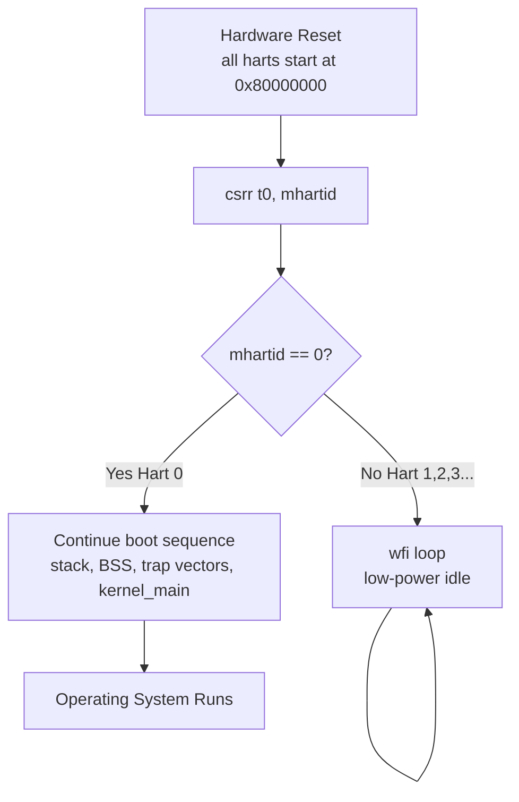

> **Real-world relevance:** This is exactly how Linux SMP boot works —  
> one primary CPU initializes everything, then wakes secondary CPUs  
> in a controlled handoff. We do the simple version: park them forever.

---

---

## Slide 17 — The Desktop Shell: Putting It All Together

`desktop.c` is the "user space" of our QEMU OS — three windows on an 80×24 grid.

### Screen Layout

```
  Col:  0         20        40        60        79
  Row:  +------------------------------------------+
   0   |  RISC-V MicroKernel OS v1.0    Tick: NNN  |  <- Status bar
   1   +------------------+---------------------+--+
   2   | System Info      |  App Launcher        |
   3   | ──────────────── |  ─────────────────── |
   4   | Hart ID:  0      |  [  Snake Game      ]|
   5   | ISA: RV32-IMA    |  [  System Monitor  ]|
   6   | Privilege: M-Mode|  [  CSR Inspector   ]|
   7   | Int Enable: Off  |  [  Memory Viewer   ]|
   8   | ──────────────── |  ─────────────────── |
   9   | CSR Snapshot     |  Use UP/DOWN + ENTER  |
  10   | mtvec: 0x80000xx |                       |
  11   | mstatus: 0x0000  +---------------------+ |
  12   | ──────────────── |  Activity Log         |
  13   | Cycle Meter      |  [00] OS booted        |
  14   | [########.....] |  [01] Platform: QEMU   |
  15   | 1234567 cycles   |  [02] GUI: 3 windows   |
  16   | ──────────────── |  [03] Press TAB...     |
  17   | Memory Map       |                       |
  18   | UART0: 0x1000000 |                       |
  23   | [TAB] Next  [ENTER] Select  [Q] Quit      |  <- Key hints
       +------------------------------------------+
```

### Live CSR Reading

```c
// Every frame, System Info window reads real hardware CSRs:
uint32_t hartid, misa, mstatus, mtvec_val, cycle;

asm volatile ("csrr %0, mhartid"  : "=r"(hartid));
asm volatile ("csrr %0, misa"     : "=r"(misa));
asm volatile ("csrr %0, mstatus"  : "=r"(mstatus));
asm volatile ("csrr %0, mtvec"    : "=r"(mtvec_val));
asm volatile ("csrr %0, mcycle"   : "=r"(cycle));
```

The cycle counter drives the **live progress bar** — you can watch the CPU counting cycles in real time.

---

---

## Slide 18 — Complete Layer Architecture

### Generation 1 vs Generation 2 — Side by Side

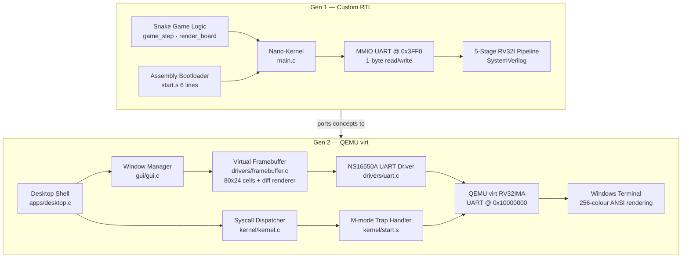

### What Each Layer Does

| Layer | Gen 1 | Gen 2 |
|---|---|---|
| **App** | Snake game loop | Desktop shell + windows |
| **GUI** | Raw ANSI chars | Window manager + widget library |
| **Framebuffer** | Direct UART writes | 80×24 cell grid with diff renderer |
| **Driver** | 1-byte MMIO | Full NS16550A register programming |
| **Kernel** | `main()` as kernel | `kernel_main()` + syscall dispatcher |
| **Boot** | 6-line `start.s` | 180-line `start.s` (hart filter, BSS, stacks) |
| **Hardware** | Custom RV32I RTL | QEMU `virt` RV32IMA |
| **Output** | Questa terminal | Windows Terminal (256 colors) |

---

---

## Slide 19 — What QEMU Is (and How We Use It)

**QEMU** (Quick EMUlator) is an open-source machine emulator and virtualizer.

### How QEMU Works

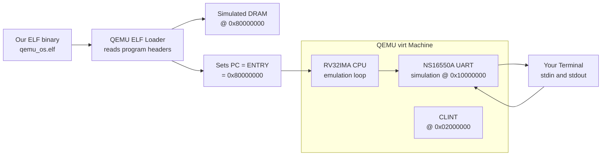

### The Run Command — Explained

```powershell
qemu-system-riscv32 `
    -machine virt     # Use the 'virt' board (standard RISC-V memory map)
    -nographic        # No GUI window — use stdin/stdout as the serial console
    -bios none        # Don't load OpenSBI (we are our own firmware)
    -m 128M           # Give the machine 128 MiB of DRAM
    -kernel build\qemu_os.elf  # Load our ELF and jump to its entry point
```

| Flag | Why We Use It |
|---|---|
| `-machine virt` | Standard UART at `0x10000000`, CLINT, PLIC included |
| `-nographic` | Redirects UART serial port to our terminal — that's how we see output |
| `-bios none` | Skips OpenSBI — our `start.s` is the first code to run |
| `-m 128M` | Our OS + stack must fit; 128 MiB is more than enough |

---

---

## Slide 20 — Design Patterns We Used

These patterns appear in real production OS code (Linux, FreeRTOS, Zephyr).

### 1. Event-Driven Input Loop (Cooperative Multitasking)

```c
while (1) {                     // Never-ending kernel loop
    int key = uart_getc_nb();   // Non-blocking poll — don't block
    if (key >= 0)
        gui_dispatch_input(key); // Route to focused window's on_input()

    gui_render_all();           // Redraw everything
    fb_flush();                 // Send diff to UART
}
```

> **Why non-blocking?** If we blocked waiting for input, the screen would  
> freeze until a key was pressed. Non-blocking poll keeps the display live.

### 2. Callback / Observer Pattern (Window Manager)

```c
// App registers callbacks — kernel calls them when needed
win->on_draw  = sysinfo_draw;    // Called every frame
win->on_input = sysinfo_input;   // Called when this window is focused
```

This is the same pattern as Linux's `file_operations` struct  
or Windows' `WndProc` callback.

### 3. Double Buffering (Framebuffer Diff)

```
  1. Render to fb_cur[][]   (off-screen buffer)
  2. Compare with fb_prev[][] (what was shown last frame)
  3. Only update cells that changed (diff)
  4. Copy fb_cur -> fb_prev
```

Used by: every GPU, every terminal emulator, every video game.

### 4. Hardware Abstraction Layer (HAL)

```c
// Application never touches UART directly:
fb_print(0, 5, "Hello", COL_WHITE, COL_DESKTOP_BG);

// Internally calls:
//   fb_set()  ->  fb_flush()  ->  uart_putc()  ->  MMIO write
```

---

---

## Slide 21 — Porting Path: From Custom RTL to QEMU

The same kernel concept runs on both platforms with minimal changes.

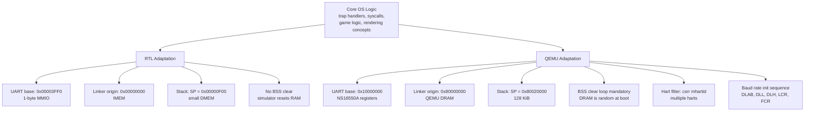

> **Key insight:** Only the **platform layer** changes.  
> The OS concepts — trap handling, syscalls, rendering loop — are identical.  
> This is the power of layered design.

---

---

## Slide 22 — The Full Design Flow Summary

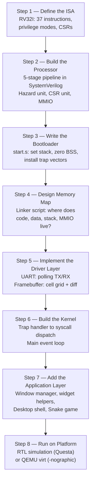

### Guiding Principle at Every Step

> **"Each layer knows only its direct neighbor."**
>
> - The Snake game does not know about UART registers.  
> - The UART driver does not know about windows or colors.  
> - The window manager does not know about hardware privilege modes.  
>
> This separation is what makes the system **testable, portable, and extensible**.

---

---

## Slide 23 — Key Takeaways

| Concept | What We Learned |
|---|---|
| **Privilege Modes** | Hardware enforces OS isolation — M-mode is sacred |
| **Trap Vectors** | `mtvec` is the first thing the OS must configure |
| **MEPC Advancement** | Forgetting `mepc += 4` causes an infinite trap loop |
| **BSS Zeroing** | Uninitialized globals are garbage at reset — always zero BSS |
| **Linker Script** | The OS "floor plan" — control memory layout explicitly |
| **MMIO** | Hardware peripherals are just memory addresses |
| **Polling vs. Interrupts** | Polling is simpler; interrupts needed for true concurrency |
| **Double Buffering** | Only transmit what changed — essential for slow UARTs |
| **HAL Design** | Abstract hardware for portable application code |
| **QEMU** | `-bios none -nographic` means we own the machine from reset |

---

---

## Appendix A — File Reference

### Generation 1 (Custom RTL)

| File | Role |
|---|---|
| `rtl/RV32I/riscv_top_pipeline.sv` | Processor datapath wrapper |
| `rtl/RV32I/riscv_csr_unit.sv` | CSR register bank + trap redirection |
| `rtl/RV32I/riscv_data_mem.sv` | Data RAM + MMIO UART at `0x3FF0` |
| `rtl/RV32I/riscv_hazard_unit.sv` | Forwarding + stall controller |
| `sw/src/start.s` | 6-line bootstrap: stack + trap vectors |
| `sw/src/main.c` | Nano-OS kernel + Snake game |
| `sw/linker.ld` | Memory map (code @ 0x0, data @ 0x2000) |

### Generation 2 (QEMU OS)

| File | Role |
|---|---|
| `qemu_os/kernel/start.s` | Full boot stub: hart filter, BSS, mtvec |
| `qemu_os/kernel/kernel.c` | Syscall dispatcher + `kernel_main()` |
| `qemu_os/drivers/uart.c` | NS16550A driver (init, putc, getc) |
| `qemu_os/drivers/framebuffer.c` | 80×24 cell grid + ANSI diff renderer |
| `qemu_os/gui/gui.c` | Window manager + widget library |
| `qemu_os/apps/desktop.c` | Three-window desktop shell |
| `qemu_os/linker_qemu.ld` | Memory map (DRAM @ 0x80000000) |

---

---

## Appendix B — Glossary

| Term | Definition |
|---|---|
| **MMIO** | Memory-Mapped I/O — hardware registers accessed via load/store instructions |
| **UART** | Universal Asynchronous Receiver-Transmitter — serial communication peripheral |
| **NS16550A** | Industry-standard UART IC, emulated by QEMU |
| **CSR** | Control and Status Register — special RISC-V registers for privilege/state |
| **mtvec** | Machine Trap Vector — address of the M-mode trap handler |
| **mepc** | Machine Exception PC — saved PC when a trap occurs |
| **mcause** | Machine Cause — reason for the last trap |
| **BSS** | Block Started by Symbol — uninitialized data section (must be zeroed) |
| **Hart** | Hardware Thread — one independent execution context in a RISC-V CPU |
| **ecall** | Environment Call — RISC-V instruction that triggers a synchronous trap |
| **mret** | Machine Return — exits M-mode trap handler, restores privilege + PC |
| **ANSI escape** | Byte sequences (ESC [..) that control terminal cursor, color, attributes |
| **DLAB** | Divisor Latch Access Bit — NS16550A mode bit to program baud rate |
| **TUI** | Terminal User Interface — visual UI rendered entirely with text characters |
| **QEMU** | Quick EMUlator — open-source hardware emulator that runs our kernel |
| **virt** | QEMU's generic RISC-V virtual machine board with standard memory map |
| **WFI** | Wait For Interrupt — low-power CPU idle instruction |
| **ELF** | Executable and Linkable Format — binary file format used by our toolchain |

---

---

## Slide 24 — The OS Is Alive: Runtime Architecture

This is what the OS looks like **while it is running** — not boot, not shutdown, but the living heartbeat.

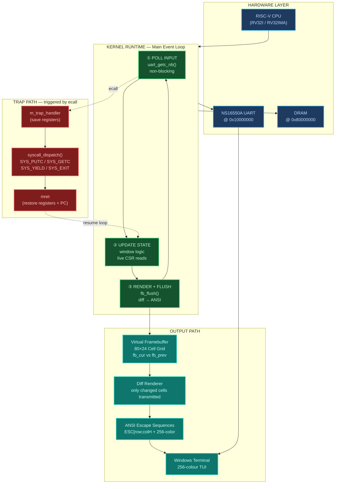

### The Three Pillars of a "Live" OS

```
  ┌────────────────────────────────────────────────────────┐
  │                                                        │
  │   PILLAR 1 — The Loop            while(1) { ... }      │
  │   The OS never stops. Every cycle: poll → update →     │
  │   render. This is the heartbeat of the system.         │
  │                                                        │
  │   PILLAR 2 — The Trap            ecall → mtvec         │
  │   Any time code needs the kernel, the CPU traps.       │
  │   The OS handles it in microseconds and resumes.       │
  │   The loop never knows it was interrupted.             │
  │                                                        │
  │   PILLAR 3 — The Diff            fb_cur != fb_prev     │
  │   Only changed screen cells are sent over UART.        │
  │   This keeps the display fast even at 115200 baud.     │
  │   Same principle as TCP — only send what changed.      │
  │                                                        │
  └────────────────────────────────────────────────────────┘
```

### Timing: One Frame in the OS's Life

```
  t=0ms  │  uart_getc_nb()          ← check if user pressed a key
  t=0ms  │  key arrived → update focused window's on_input()
  t=0ms  │  gui_render_all()        ← all on_draw() callbacks fire
  t=0ms  │  fb_flush()              ← diff: 4 cells changed this frame
  t=0ms  │  emit 4× (cursor + color + char) over UART
  t=1ms  │  loop restarts           ← start of next frame
         │
         │  [if ecall happened during on_draw()]
  t=0ms  │  → CPU jumps to m_trap_handler (M-mode)
  t=0ms  │  → syscall_dispatch() handles SYS_PUTC
  t=0ms  │  → mret → back to on_draw() at next instruction
         │  [caller never knew the trap happened]
```

> The OS is alive as long as the loop spins.  
> Every rotation = one frame of the display refreshed + one input check.  
> The trap handler is the emergency lane — fast in, fast out.
